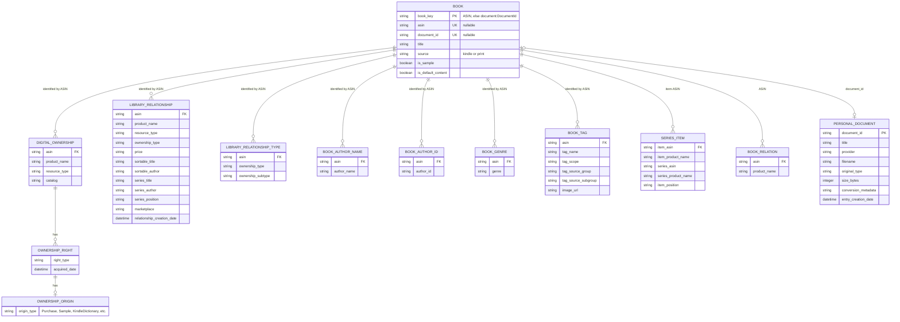

# Kindle export reconstruction: entity–relationship diagram

This diagram describes the entities currently connected by the reconstruction code.
`BOOK` is a synthesized entity; it does not exist as a single table in the Amazon
export.



## Identity and joins

The synthesized `BOOK.book_key` is:

```text
ASIN
```

or, for a personal document without an ASIN:

```text
document:<DocumentId>
```

Almost every source joins through ASIN. The exceptions are:

- Personal documents are identified by `DocumentId` when they have no ASIN.
- Saga series rows use `item-ASIN`; `urn:collection:1:asin-…` values are normalized.

No joins use title, author name, author ID, order ID, or filename.

## Canonical field authority

When several datasets repeat a field, the normal columns use these authoritative
sources. Raw mode instead exposes the original values under their source paths:

| Canonical field | Authority / precedence |
|---|---|
| `asin` | The normalized ASIN used as the book key |
| `document_id` | `Kindle.KindleDocs.DocumentMetadata.DocumentId` |
| `title` | Unified Library Index relationship, then Saga series item, BookRelation, then Digital Ownership; personal documents use DocumentMetadata |
| `authors` | Union of `CustomerAuthorNameRelationship.Author Name` values |
| `genres` | Union of `CustomerGenres.Genre` values |
| `series_title` | Saga `series-product-name`, falling back to the ULI relationship `Series Title` |
| `series_position` | Saga `item-position-in-series`, falling back to ULI `Position In Collection` |
| `source` | Kindle-specific provenance wins; an owned ULI item without Kindle provenance is `print` |
| `is_sample` | True when any ownership resource, origin, or ULI ownership record marks it as a sample |

For repeated technical metadata, `CustomerRelationshipTypes` is authoritative for
`Ownership Type` because it is the dedicated ownership-type relation; only owner and
sample-owner rows are retained. Its `Ownership Subtype` is retained alongside it.
The duplicate `CustomerRelationshipIndex.Ownership Type` field is omitted.

Distinct fields are not collapsed merely because their names are similar. For
example, ULI `Resource Type` (`ITEM`) and Digital Ownership `resourceType`
(`KindleEBook`, `KindleEBookSample`, etc.) describe different layers and both remain.
Likewise, `series-ASIN` identifies the series, not the book.

In `--raw` mode, every field carries explicit provenance. Only the computed `source`
and `is_sample` columns are named `synthetic->{field_name}`. Identifiers, titles,
authors, genres, and series data are emitted from the source records rather than as
synthetic canonical fields. Source columns are named
`{export-relative/path/to/file}->{field_name}`; nested JSON field names retain their
object path, such as `rights.acquiredDate`. Numbered files are rewritten as
`{directory}/shard.{extension}` only when at least two siblings share the same base
name and extension. Matching versioned dataset directories are combined under paths
such as `CustomerRelationshipIndex.*/*.csv`. Singleton numbered/versioned files keep
their exact paths.

Acquisition-related dates remain separate because they come from three different
entity types and do not have identical semantics:

- `Digital.Content.Ownership/shard.json->rights.acquiredDate` for Kindle ownership
  rights
- the applicable `CustomerRelationshipIndex` CSV path followed by
  `->Relationship Creation Date` for ULI ownership relations
- the `DocumentMetadata` CSV path followed by `->EntryCreationDate` for personal
  documents

## Classification derived from provenance

- A resource present in `DIGITAL_OWNERSHIP`, or another Kindle-specific source, is
  classified as `source=kindle`.
- An owned ULI item with no Kindle provenance is classified as `source=print`.
- `resourceType=KindleEBookSample`, `ownershipType=Sample Owner`, or
  `originType=Sample` marks a sample.
- `originType=KindleDictionary` or `KindleUserGuide` marks default Kindle content.

## Available but not connected

`CustomerOrders` is deliberately not part of the reconstructed book entity. It can
join to a book by ASIN, while `Order ID` groups transaction lines, but order type,
quantity, and order identity describe a purchase transaction rather than the book.
There is no other table in this Kindle export that can be joined through Order ID.

Likewise, Author ID is retained as book metadata, but this export has no author entity
table to enrich through that ID. It currently appears only in the book-to-author-ID
relationship files.

## Intentionally ignored activity entities

The following activity and operational tables are not entities in the diagram, are
not used for book reconstruction, and are not exposed by `--raw`:

- `Kindle.UserUniqueTitlesCompleted.csv` (completed-title activity)
- `Kindle.reading-insights-sessions_with_adjustments.csv` (reading sessions)
- `whispersync.csv` (bookmark, annotation, and synchronization state)
- `Kindle.KindleContentUpdate.ContentUpdates.csv` (automatic content updates)
- `Kindle.KindleContentUpdate.ManualContentUpdates.csv` (manual update requests)
- `Kindle.KindleContentUpdate.AnnotationUpdates.csv` (annotation update operations)

In particular, `personal_document_id` from the activity tables is not used as a join.
Personal documents come directly from `Kindle.KindleDocs.DocumentMetadata.csv` and
are identified by its `DocumentId`.
