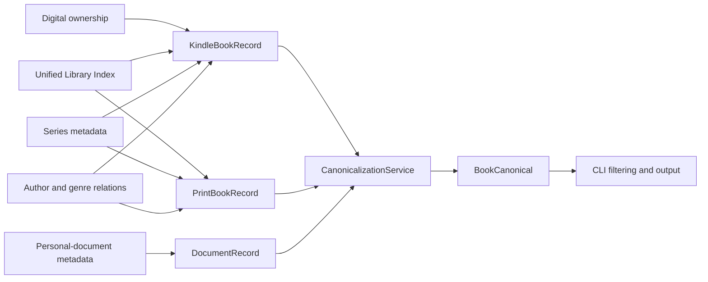

# Kindle export reconstruction model

The application keeps ownership-specific source records separate until all relevant
sources have been joined. `CanonicalizationService` then converts each source type to
`BookCanonical`.



## Canonical schema

`BookCanonical` contains:

- `key: CanonicalKey`
- `title: str`
- `authors: Authors`
- `ownership_digital: DigitalOwnership`
- `ownership_print: bool`
- `series: Series`
- `genres: list[str]`
- `marketplace: str`

The default CLI output contains key, title, author, digital ownership, and print
ownership. `--extra` adds series, genres, and marketplace.

### Canonical key

`CanonicalKey` retains the source ASIN/sample distinction or a personal-document ID.
Its string representation is:

```text
asin:ebook:<ASIN>
asin:sample:<ASIN>
document:<DocumentId>
```

### Ownership

`DigitalOwnership` has these values:

- `unknown`: no digital-ownership evidence; normally a print-only ULI record
- `default`: content supplied by Amazon, including dictionaries, user guides, and the
  Cloud Drive notice
- `kindle_sample`
- `kindle_ebook`
- `personal_document`

`ownership_print` is true only when an owned Unified Library Index item has no digital
ownership evidence. ULI also repeats many Kindle purchases, so its presence cannot by
itself prove ownership of a separate physical edition. The export cannot reliably
represent simultaneous print and Kindle ownership under one ASIN.

## Canonical precedence

- **Title:** ULI `Sortable Title`, then the selected ordinary title. Ordinary-title
  precedence remains ULI Product Name, Saga item product name, BookRelation Product
  Name, Digital Ownership Product Name, or personal-document Title as applicable.
- **Authors:** all `Author Name` relation values, falling back to ULI `Sortable Author
  Name` only when no author-name relationships exist, then `DocumentProvider` for
  personal documents. The sortable value never replaces or supplements ordinary
  names because it may contain only the primary author and uses different formatting.
  `Authors.asin` is the book ASIN tying the names to their source relationship;
  individual author names cannot safely be paired with Author IDs.
- **Series:** Saga `series-product-name`, `series-ASIN`, and item position; ULI Series
  Title and Position are the fallback. The export has no explicit sortable series
  title.
- **Genres:** distinct CustomerGenres values.
- **Marketplace:** ULI Marketplace. Conflicts produce a warning on stderr. An
  `amazon.com` domain wins; otherwise the first value by sorted domain wins.

## Source joins

Kindle ebook and sample rows are accumulated as separate `KindleBookRecord` objects,
deduplicated by ASIN and variant. They are grouped by ASIN when passed to
`CanonicalizationService.convert_kindle(*records)`, but currently remain separate
canonical outputs. Print records are deduplicated by ASIN, while personal documents
are deduplicated by `DocumentId`. Saga item identifiers with the
`urn:collection:1:asin-` prefix are normalized before joining.

No joins use title, author name, author ID, order ID, filename, or fuzzy matching.
Author-ID rows are retained in the joined source data but do not identify a particular
name when a book has multiple authors.

## Classification evidence

- Digital Content Ownership proves Kindle digital ownership.
- A ULI `Sample Owner` relation proves sample ownership.
- Personal-document metadata proves personal-document ownership.
- ULI `Item Owner` without digital evidence produces `unknown` digital ownership and
  true print ownership.
- Ownership origins `KindleDictionary` and `KindleUserGuide` identify defaults.
- The Cloud Drive notice is identified by provider and filename rather than its
  account-specific document ID.

## Deliberately separate activity

Reading sessions, Reading Insights, Whispersync annotations/state, completion events,
content updates, and device activity are not joined into `BookCanonical`. They are
event or device entities referencing logical content, not intrinsic book metadata.
CustomerOrders is likewise a transaction entity and is not joined.
